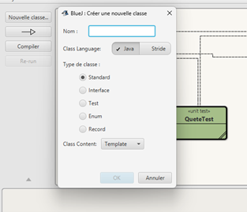
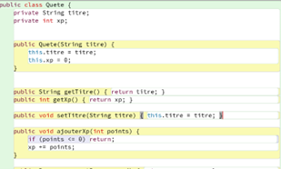
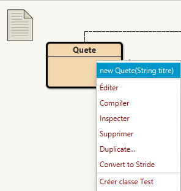
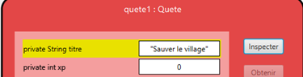
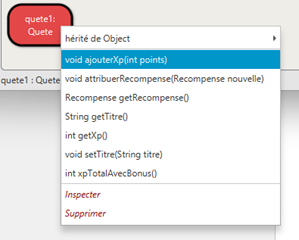

# 🏰 La Quête du Village Oublié

> 🧙‍♂️ *Dans un monde lointain, chaque action compte.*  
> *Une quête n’est jamais vide de sens : elle accumule de l’expérience…*  
> *et parfois, une récompense vient couronner l’effort.*

---

## 🗺️ Table des matières

- 🎬 [Introduction](#-introduction)
- 📜 [Chapitre 1 – Naissance d’une Quête](#-chapitre-1--naissance-dune-quête)
- 🔥 [Chapitre 2 – La Quête prend vie](#-chapitre-2--la-quête-prend-vie)
- 💎 [Chapitre 3 – L’apparition d’une Récompense](#-chapitre-3--lapparition-dune-récompense)
- 🔗 [Chapitre 4 – Le lien sacré](#-chapitre-4--le-lien-sacré)
- ⚔️ [Chapitre 5 – Le sauvetage du village](#-chapitre-5--le-sauvetage-du-village)
- ⚖️ [Chapitre 6 – Les sages écrivent les règles](#-chapitre-6--les-sages-écrivent-les-règles)

---

## 🎬 Introduction

Bienvenue, **aventurier du code**.

Ce tutoriel est une **aventure pédagogique** dont l’objectif est double :

- 🧠 comprendre la **programmation orientée objet**
- 🧪 apprendre à **tester et valider son monde** avec **des tests**

Chaque action réussie vous fera **gagner de l’XP**.  
Chaque erreur… vous apprendra quelque chose.

---

## 📜 Chapitre 1 – Naissance d’une Quête

Nous commençons notre aventure en créant notre **objet principal** :  
✨ **la Quête**.

Dans ce monde, une quête n’est pas un simple mot.  
Elle possède des caractéristiques bien précises :

- 🏷️ un **titre**
- ✨ une quantité d’**expérience (XP)** gagnée au fil des actions

---

### 🧱 Création de la classe `Quete`

Pour créer notre classe **Quete**, il suffit de :

1. Faire un **clic droit** dans BlueJ  
2. Choisir **Nouvelle classe**
3. Sélectionner :
   - **Langage** : Java  
   - **Type** : Classe  
   - **Nom** : `Quete`
📸 *Création de la classe `Quete` dans BlueJ*  

  

Une fois la classe créée, nous devons la compiler.

---
### Structure interne de la Quête

Pour évoluer, une quête doit mémoriser son état et pouvoir changer dans le temps.

Nous lui ajoutons donc :
- un **titre** (`String`)
- une **expérience** (`int`)
- un **constructeur**
- une méthode permettant de **gagner de l’XP**

  

Avant d’ajouter de l’XP, nous vérifions que la valeur est valide.
Une quête ne progresse que par des actions positives.

🔥 Donner vie à une Quête
Notre guilde d’aventuriers est maintenant prête.
Il ne reste plus qu’à créer une véritable quête.

#### 🛠️ Dans BlueJ

Pour donner vie à la quête :

1. **Clic droit** sur la classe `Quete`
2. Sélectionner `new Quete(String titre)`
3. Donner un **nom** à la quête

  

  

---

🎉 Félicitations !
Vous avez créé une classe et lui avez donné vie.

🏆 +10 XP

## 🔥 Chapitre 2 — La Quête prend vie

> *Une quête créée n’est encore qu’un potentiel.*  
> *Pour exister réellement, elle doit évoluer.*

Maintenant que notre classe `Quete` est instanciée, il est temps de lui **donner vie**.  
Pour cela, nous allons utiliser les **méthodes** que nous avons définies.

---

### 🧠 Découvrir les méthodes de la Quête

En inspectant une instance de `Quete` dans **BlueJ**, nous pouvons observer toutes les méthodes disponibles :

- `ajouterXP(int points)` → permet de faire progresser la quête
- `getXp()` → permet de connaître l’expérience actuelle
- `getTitre()` → permet de récupérer le nom de la quête

  

---

### ✨ Gagner de l’expérience (XP)

La première action possible est d’ajouter de l’expérience à la quête.

Pour cela :
1. **Clic droit** sur l’instance de `Quete`
2. Choisir la méthode `ajouterXP(int points)`
3. Entrer une valeur positive (par exemple `25`)

La quête progresse.  
Son état interne a changé.

---

### 🔍 Observer l’évolution de la Quête

Pour vérifier le résultat, nous utilisons la méthode `getXp()`.

1. **Clic droit** sur l’instance
2. Sélectionner `getXp()`
3. Observer la valeur retournée

  

Le résultat confirme que l’expérience a bien été ajoutée.

---

🎉 **Félicitations !**  
Vous avez réussi à :
- utiliser une méthode
- modifier l’état d’un objet
- observer le résultat de cette modification

🏆 **+20 XP**

---

> *La quête avance…*  
> *Mais une grande aventure mérite toujours une récompense.*

➡️ **Chapitre suivant :** 💎 *L’apparition d’une Récompense*